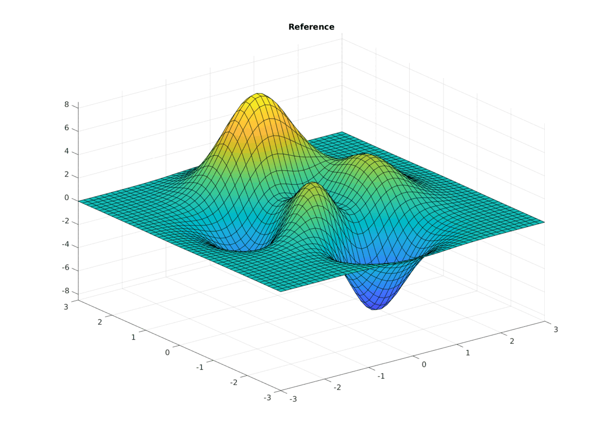

# Two-layered Vectorial Kernel Models for Detailed Surface Kinetics using a Goal-Oriented Approach

## Watch a Kernel model train

Fitting MATLAB's *peaks()* function with a gaussian Kernel Model.
The model is greedy, i.e. it iteratively chooses the points where the difference to the reference function is highest and adds a new gaussian function there.
All those Gauss functions have the same width.

## General
[Annual Meeting on Reaction Engineering 2023](https://dechema.de/en/REACT2023.html) 15.-07.05.2023 in FFM.  
